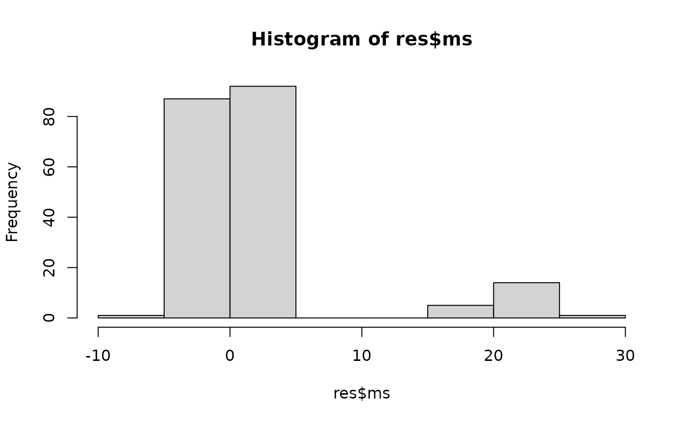

# Two Gaussians

``` r
library(SplitClusterTest)
```

Imagine you have data from two distinct clusters, each with 200 features
and 50 observations. The interesting part: only 10% of these features
(20 features) actually differ between the groups. The remaining features
are identically distributed. The magnitude of these differences is
controlled by a parameter called `delta`.

## Generating Example Data

Let’s create such a dataset using the `gen_data_normal` function:

``` r
data = gen_data_normal(n = 100, p = 200, prop = 0.1, delta = 3)
X = data$X
L = data$L
```

In this example:

- Features 1 through 20 are truly different between clusters
  (`delta = 3`)
- Features 21 through 200 are identically distributed (no difference)

## Identifying Non-null Features by DS

Now, let’s use our DS procedure to automatically identify which features
distinguish the two clusters while controlling the false discovery rate
(FDR) at a nominal level of `q = 0.2`:

``` r
set.seed(1)
res = ds(X, q = 0.2)
names(res$sel_set)
#> NULL
```

## Evaluating Performance

We know the ground truth: features 1–20 are truly different. Let’s
measure how accurately DS identified them:

``` r
calc_acc(res$sel_set, 1:20)
#>        fdr      power         f1 
#> 0.04761905 1.00000000 0.97560976
```

This gives us:

- **Precision (1 - FDR)**: Proportion of selected features that are
  truly different
- **Recall (Power)**: Proportion of true features that were correctly
  identified
- **F1 score**: Harmonic mean of precision and recall

## Visualizing Mirror Statistics

DS uses mirror statistics to distinguish signal from noise. Let’s
visualize their distribution:

``` r
hist(res$ms)
```



**Interpretation**: Mirror statistics with large positive values suggest
strong evidence of differences between clusters.

## A More Robust Approach: MDS

For increased robustness against variability, you can use the MDS
(Multiple DS) procedure, which aggregates results across multiple random
splits:

``` r
set.seed(1)
res = mds(X, M = 10, q = 0.2)
#> use the tie.method =  fair
```

Check the accuracy of the selected set

``` r
calc_acc(res, 1:20)
#>   fdr power    f1 
#>     0     1     1
```

## 💡 Key Takeaways

- DS provides a straightforward approach to feature selection with FDR
  control
- MDS offers enhanced robustness through aggregation across multiple
  random splits
- Both methods aim to identify the 20 truly different features while
  controlling false discoveries
- The histogram of mirror statistics helps visualize the separation
  between signal and noise
